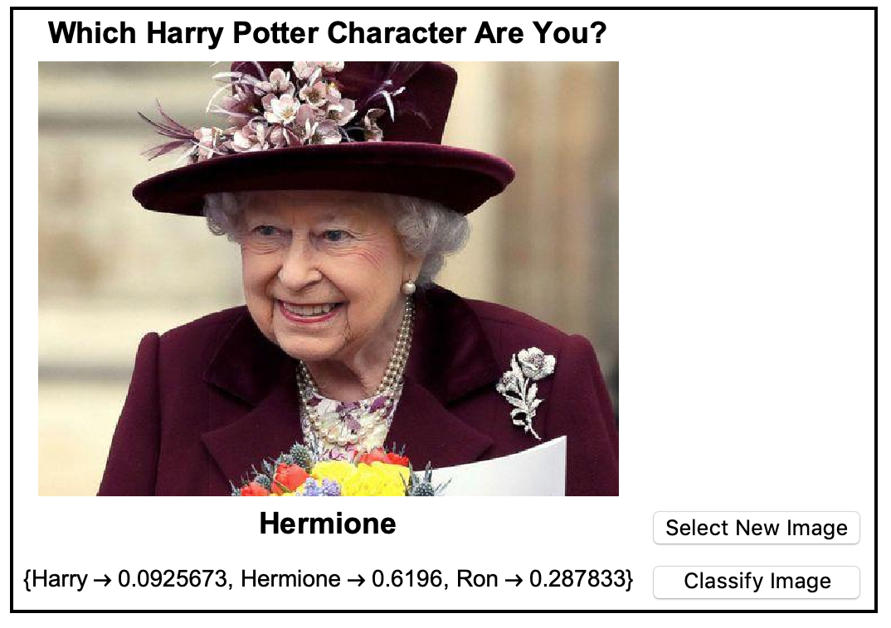

## Introduction

In this project, you'll use simple Classification and machine learning to find out which Harry Potter character you look like most!

### What you will make

--- print-only ---

--- /print-only ---

--- collapse ---
---
title: What you will need
---
### Hardware

+ Either a computer or a Raspberry Pi
+ You have the option to use a camera (built or external)

### Software

+ Wolfram Language
+ This project can be completed in a web browser using [wolframcloud.com](http://lab.wolframcloud.com/app/). Log in, and click Create New Notebook.

--- /collapse ---

--- collapse ---
---
title: What you will learn
---

+ Using `Classify` to build simple machine learning classifications
+ Using Wolfram to take photos
+ Using buttons and `Dynamic` to create interactivity

If you have never used the Wolfram Language before, follow [this guide](https://projects.raspberrypi.org/en/projects/getting-started-with-mathematica). You'll need to look at Starting Mathematica and Programming in Mathematica. If you are using the web browser version of Wolfram, you only need to look at Programming in Mathematica.

--- /collapse ---

--- collapse ---
---
title: Additional information for educators
---

If you need to print this project, please use the [printer-friendly version](https://projects.raspberrypi.org/en/projects/project-name/print){:target="_blank"}.

[Here is a link to the resources for this project](http://rpf.io/project-name-go).

--- /collapse ---
