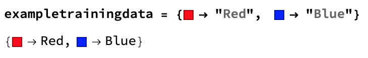
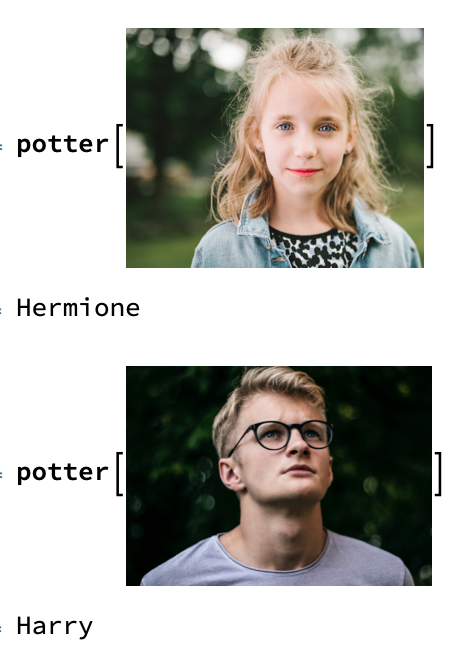
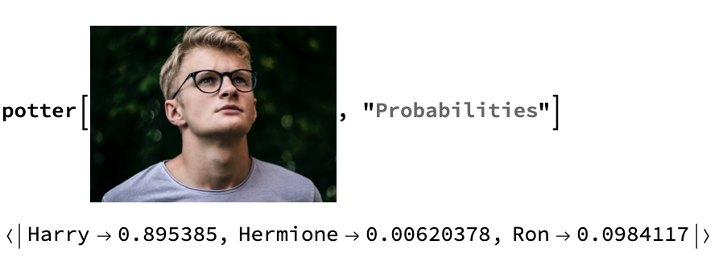

##  Build a Classify function

--- task ---
If you have never used the Wolfram Language before, follow [this guide to get started](https://projects.raspberrypi.org/en/projects/getting-started-with-mathematica) and learn to use the tool. Look at the sections **Starting Mathematica** and **Programming in Mathematica**.
--- /task ---

You are going to create a **classifier** program that will learn to identify categories of images. The classifier will then be able to look at new images and guess which category they belong to. You're going to use images of Harry Potter, Hermione Granger, and Ron Weasley as data for the categories.

You will use the `Classify` function to sort images of _Harry Potter_ characters depending on the features of the images.

First, you need images of Harry, Ron, and Hermione so that you can train the classifier to recognise their faces. To do this, you need to get the URL to a Google image search and then use `Import` to import the images.

Then train a classifier function on these images, so that it puts them into three categories: "Harry", "Ron", and "Hermione".

--- task ---
Create a `Classify` function called `potter` using Google image search results for each main Harry Potter character.

```
potter = Classify[<|
   "Harry" -> 
    Import["https://www.google.co.uk/search?q=\"harry+potter\"+\"\
Daniel+Radcliffe\"&tbm=isch", "Images"], 
   "Ron" -> 
    Import["https://www.google.co.uk/search?q=\"ron+weasley\"+\"\
Rubert+Grint\"&tbm=isch", "Images"], 
   "Hermione" -> 
    Import["https://www.google.co.uk/search?q=\"hermione+granger\"+\"\
emma+watson\"&tbm=isch", "Images"] |>]
```

Run this function. It runs for a while, because it works with a lot of images.
--- /task ---

--- collapse ---
---
title: How does the classifier work?
---
First, a classifier associates a label to a value.

In the following example training data, the colour red fits into the category `"Red"`, and the colour blue fits into the category `"Blue"`.



But you don't know which category the colour orange falls into. This is because you  the computer doesn't have that information. Using `Classify`, you teach the computer to make a good guess.

Run the following code to train a `Classify` function on this training data.

``` classified = Classify[exampletrainingdata]```

After waiting a few seconds, you should get a `ClassifierFunction`.


The `ClassifierFunction` has the categories (classes) `"Red"` and `"Blue"`. Now test how good this `Classify` function is at deciding which category a new colour should go in.


The `Classify` function puts the new colour into the category that contains the images that most closely resemble the new colour.

--- /collapse ---

Now test the `potter` function with images it doesn't know.

--- task ---
Find two photos each of Harry, Ron, and Hermione. Ideally, one of the two images should show the character when they are young, and the other should show them when they are older.

Test your `potter` classifier with the images by replacing `image1` with the first image, `image2` with the second image, and so on. (If you are using Wolfram in a browser, save the images to your desktop and then drag and drop them into the notebook.)

`potter[{image1,image2,image3,image4,image5,image6}]`

You should get the classification for each image as the output.
--- /task ---

Now test what the function does when you give it a photo which is not of one of the characters.



You should see that the classifier puts the image into the most similar category.

You can check how sure the `Classify` function is about its classification by using `Probabilities`. This gives the probability that an image fits into each class. In this case, there is an 89.5% probability that the image fits into the `Harry` class.



--- task ---
Add two more characters to your classifier: Neville Longbottom, played by Matthew Lewis, and Luna Lovegood, played by Evanna Lynch.

--- hints ---
--- hint ---
Look at the code of the `potter` classifier and see where the names of the characters and actors appear. In case you don't know them:

  + Harry Potter is played by Daniel Radcliffe
  + Hermione Granger iss played by Emma Watson
  + Ron Weasley iss played by Rupert Grint

These names are used in Google image searches for pictures of the characers. You need to do the same for the two new ones.
--- /hint ---
--- hint ---
You need to add two more lines to your classifier, with the character and actor names for Neville and Luna.

Notice that the last line of the `potter` classifier is a bit different to the other lines.
--- /hint ---
--- hint ---
Here's the code you need:
```
potter = Classify[<|
   "Harry" -> 
    Import["https://www.google.co.uk/search?q=\"harry+potter\"+\"\
Daniel+Radcliffe\"&tbm=isch", "Images"], 
   "Ron" -> 
    Import["https://www.google.co.uk/search?q=\"ron+weasley\"+\"\
Rubert+Grint\"&tbm=isch", "Images"], 
   "Hermione" -> 
    Import["https://www.google.co.uk/search?q=\"hermione+granger\"+\"\
emma+watson\"&tbm=isch", "Images"],
   "Neville" -> 
    Import["https://www.google.co.uk/search?q=\"neville+longbottom\"+\"\
matthew+lewis\"&tbm=isch", "Images"],
   "Luna" -> 
    Import["https://www.google.co.uk/search?q=\"luna+lovegood\"+\"\
evanna+lynch\"&tbm=isch", "Images"] |>]
```
--- /hint ---
--- /hints ---
--- /task ---
