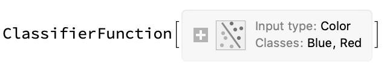
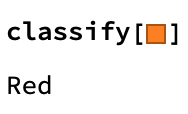

##  Building a Classify Function

We will be using the Classify function to put images of each character into buckets, depending on the features of the image.
The Wolfram Language can handle a lot of image processing tasks for us, so we don't need to worry about that.

Let's look at how the Classify function works.
First, we need to associate a label to a value.

```exampletrainingdata = {1 -> "A", 2 -> "A", 3.5 -> "B", 4 -> "B"};```

If we look at this training data, we can see that 1 and 2 both fit into the category "A", and that 3.5 and 4 both fit into the category "B".
But we can't tell what category 2.5 or 6 fall into. Classify helps us to make a good guess. Let's train a Classify Function on this training data.

``` classified = Classify[exampletrainingdata]```

When you evaluate `classified`, after waiting a few seconds, you should get a `ClassifierFunction`.



The `ClassifierFunction` has categories (Classes) A and B. Let's see how good this Classify Function is at telling us which category a number should go in.

We know that the number 2 fits into category A. But what about numbers we've never told the classify function about?



The classify function put the numbers into the category whose members most closely resembled the new number.

Now that we know what a classify function is, we can apply it to our problem. Instead of numbers, we are going to use images of Harry Potter, Hermionie Granger and Ron Weasley as data for our categories.

First, we need to find images of Harry, Ron and Hermione, so that we can train our Classifier to recognise their faces. We can do this by finding the URL to a Google image search, and then using Import to import the images.

We will then train a classifier function on the images, putting them into three categories: "Harry", "Ron", and "Hermionie".
--- task ---

Create a `Classify` function called `potter` using Google Images search results for each main Harry Potter character.

```
potter = Classify[<|
   "Harry" -> 
    Import["https://www.google.co.uk/search?q=\"harry+potter\"+\"\
Daniel+Radcliffe\"&tbm=isch", "Images"], 
   "Ron" -> 
    Import["https://www.google.co.uk/search?q=\"ron+weasley\"+\"\
Rubert+Grint\"&tbm=isch", "Images"], 
   "Hermione" -> 
    Import["https://www.google.co.uk/search?q=\"hermione+granger\"+\"\
emma+watson\"&tbm=isch", "Images"] |>]
```

This function will take some time to evaluate.

--- /task ---

Let's test the `Classifier` function with images it hasn't seen before.

You can classify an image by copy/pasting an image into your notebook and calling `potter` with the image as a variable.


--- task ---
Test your `potter` classifier by running several images through it in a list. You should get the classification for each image as the output.

In this code, replace `image1` by copy/pasting the first image, `image2` with the second image etc.

`potter[{image1,image2,image3,image4,image5,image6}]`


--- /task ---

It looks like our Classifier is doing quite well. It recognises the characters even when they look younger or older, or have very different backgrounds. 

Let's see what the function does when we ask it to classify a photo which is not of one of the characters.


We can also see how sure the Classify function is by using `Probabilities`


