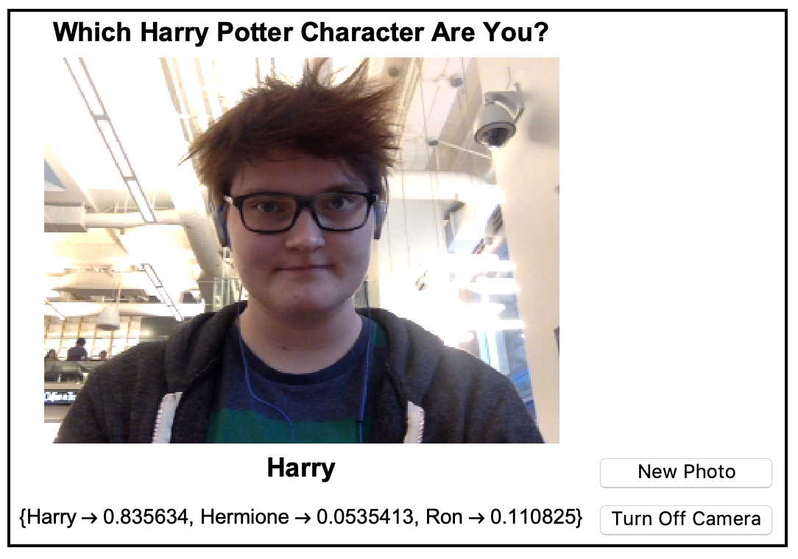

## Building an Interface

At this point, you have created two buttons. If you're using a camera, one button will take a photo and the other button will close the camera. If you are not using a camera, one button will set the file path, and the other button will import the image.

Now that you have these two buttons, which allow you to get your own image, either from your camera or from your computer, you can build an interface.

We can use `Grid` to create a good looking interface.

We can construct this using `Grid`.
Let's look at an easy example of `Grid`


`Grid` is made up of a list of lists, where each list becomes a row in the grid.

--- task ---

Make a `Grid` with four rows.

The first row should have a title. You can make text look the way you want using `Text` and `Style`.
The second row should be the `Dynamic` image. This will either be the image from your camera, or the image you import using your buttons.
The third row should have two items: the result of your `Classify` function, and your first button. The first button will be either `CurrentImage`, or `FileNameSetter`, depending on your method.
The fourth row should have two items: the result of `"Probabilities"` from your `Classify` function, and your second button. The second button will either turn off the camera, or import the file and classify the image.

You can use `Frame` styling options to change how the frame looks.

If you are using a camera:
```
Grid[{
  {Text[Style["Which Harry Potter Character Are You?", Bold, 
     18]]}, {Dynamic[image]}, {Text[
    Style[Dynamic[character], Bold, 18]], Button["New Photo",
    image = CurrentImage[ImageSize -> 350];
    character = potter[image];
    probabilities = Normal[potter[image, "Probabilities"]]]}, {Text[
    Style[Dynamic[probabilities], 14]], 
   Button["Turn Off Camera", DeviceClose[First[Devices["Camera"]]]]}},
  Frame -> True, FrameStyle -> Thick]
```

If you are importing a file:

```
Grid[{
  {Text[Style["Which Harry Potter Character Are You?", Bold, 
     18]]}, {Dynamic[image]}, {Text[
    Style[Dynamic[character], Bold, 18]], 
   FileNameSetter[Dynamic[file], 
    Appearance -> "Select New Image"]}, {Text[
    Style[Dynamic[probabilities], 14]], Button["Classify Image",
    image = Import[file];
    character = potter[image];
    probabilities = Normal[potter[image, "Probabilities"]]]}}, 
 Frame -> True, FrameStyle -> Thick]
 ```
---/task ---

