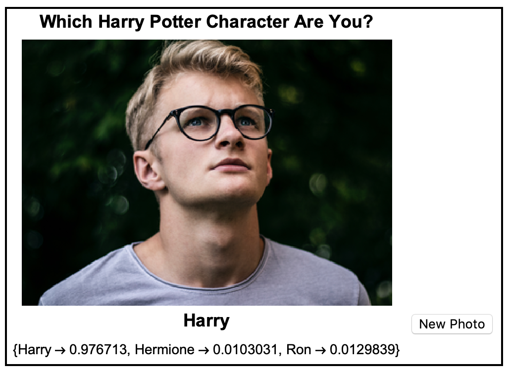

Challenge: Improve the User Experience

Try to make your Manipulate look better, and improve the user experience.
There are a few things you could do to make it look good, try to work out how to make these changes.
1) Make labels for the variables, so that they have real names, instead of n and a
2) Add images to the buttons "Coins" and "Dice"
3) Set n and a to start off at a specific value, so that we get an answer as soon as we run the manipulate.
4) Change the size of the panel so that it doesn't change size with different numbers of coins/dice

Try to create an interface like this:

